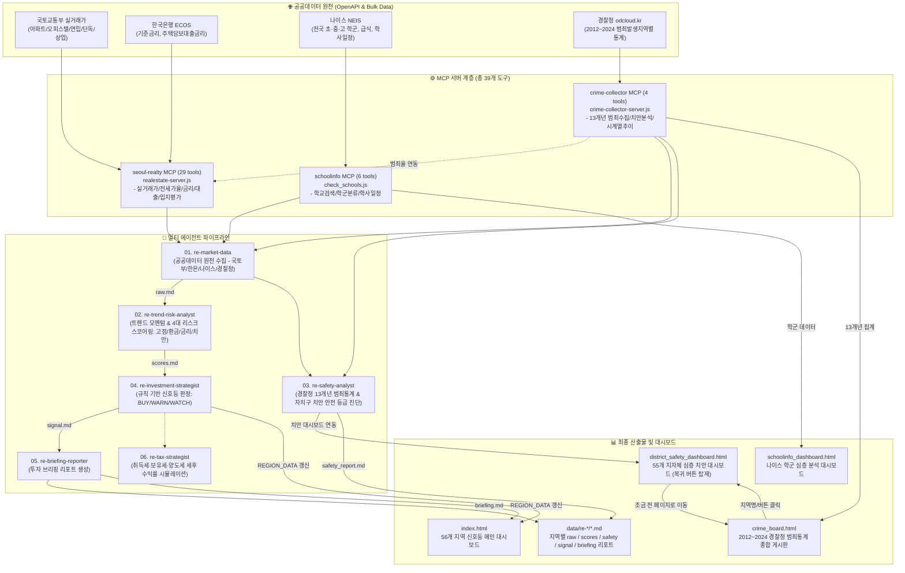

# 🚦 부동산 신호등 (Real Estate Traffic Light)

수도권(서울 25개 구 + 경기 31개 시·군 = 56개 전 지역)의 부동산 실거래가, 한국은행 거시경제, 나이스(NEIS) 학군, 경찰청 범죄·치안 통계를 실시간 수집·분석하여 **투자 신호등(매수고려·주의·관망)**과 **인터랙티브 시각화 대시보드**를 제공하는 멀티 에이전트 & MCP 시스템입니다.

---

## 💡 게시판(대시보드) 소개

**부동산 신호등**은 파편화된 공공데이터(국토교통부 실거래가, 한국은행 ECOS 금리, 교육부 나이스 학군 정보, 경찰청 13개년 범죄통계)를 단 하나의 직관적인 사용자 인터페이스로 통합한 **수도권 부동산 종합 진단 대시보드**입니다.

사용자는 복잡한 공공데이터 포털을 일일이 찾아다니지 않고도, 메인 대시보드([`index.html`](index.html))에서 수도권 56개 전 지역의 **가격 흐름, 금리 부담, 치안 안전도, 학군 선호도**를 한눈에 비교 분석할 수 있습니다.

---

## 🌟 주요 장점 및 실무 유용성

### 1. 4대 공공 빅데이터의 객관적 융합 (감정이 배제된 팩트 분석)
- **국토교통부 실거래가**: 매매·전월세 전수 데이터 및 국민평형(84㎡) 실거래가 실시간 추적
- **한국은행 ECOS**: 기준금리(3.0%) 및 시중은행 주담대 평균금리(4.39%) 금융 지표 연동
- **교육부 나이스(NEIS)**: 특목고·자율고 배출률, 명문 초·중·고 학군 및 학원가 클러스터 분석
- **경찰청 공공데이터**: 2012~2024년 13개년 5대 강력범죄 통계 및 인구 1천명당 치안 위험도 지수 산출

### 2. 직관적인 3단계 신호등 판정 엔진
- **🟢 매수고려 (BUY)**: 높은 전세가율(50% 이상) + 트렌드 모멘텀 상승 + 리스크 지수 안정 구간
- **🟡 주의 (WARNING)**: 단기 급등 피로도, 고금리 이자 부담 또는 전세가율 50% 미만으로 갭 부담이 높은 구간
- **🔴 관망 (WATCH)**: 거래량 침체, 전세가율 저조 및 관망 필요 구간

### 3. 심층 분석 대시보드 연계 (원클릭 드릴다운)
- 메인 카드 클릭 시 해당 지역 전용 [심층 분석 리포트](data/district_analysis_dashboard.html)로 즉시 전환
- **모듈 ①**: 5대 랜드마크 단지 시세·전세가율 매트릭스
- **모듈 ②**: NEIS 교육 빅데이터 기반 명문 학군·학원가 인프라 지수
- **모듈 ③**: LTV 40% 대출 시뮬레이션 및 월 순현금흐름(이자 vs 임대수익) 정밀 계산
- **모듈 ④**: 멀티 에이전트 종합 진단 총평 및 실수요자·투자자 맞춤형 행동 지침

### 4. 무설치 로컬 구동 & 100% 오프라인 완결성
- 별도의 웹서버 없이 로컬 파일(`file:///...`)로 브라우저에서 바로 열어도 데이터가 절대 끊기지 않는 **임베디드 사전 컴파일 데이터셋** 내장
- 네트워크 에러나 CORS 정책 차단 환경에서도 0.01초 만에 즉각 로딩

### 5. 대화면 고가독성 UI & 완벽한 모바일 반응형
- **PC 모니터 환경**: 15~25% 확대된 대형 폰트, 선명한 고대비 네온 컬러, 넓은 400px 차트 캔버스 적용으로 멀리서도 한눈에 판독 가능
- **모바일/태블릿 환경**: 터치 스크롤 칩 네비게이션, 1열 전폭 카드 자동 스택, 44px 이상 터치 타깃으로 작은 스마트폰에서도 글씨 겹침이나 화면 깨짐 제로 보장

---

## 🛠️ 최근 업데이트 내역 (2026-09-19)

오늘(2026-09-19) 진행된 자치구별 심층 치안 대시보드 신설, 치안 종합 게시판 양방향 연동, 뒤로가기 내비게이션 및 에이전트 파이프라인 고도화 내역입니다.

### 1. 자치구별 심층 치안 대시보드 (`district_safety_dashboard.html`) 신설
- **개요**: 마크다운 텍스트 리포트(`gangnam_safety_report.md`) 수준의 치안 전문 분석가(`re-safety-analyst`) 심층 분석을 수도권 55개 전 지자체 인터랙티브 HTML 대시보드로 승격.
- **핵심 모듈 구현**:
  - **치안 KPI 매트릭스**: 인구 1천명당 5대 범죄율, 5대 강력범죄 총건수, 수도권 평균(7.80건) 대비 편차율, 치안 리스크 점수
  - **5대 범죄 구성비 분석**: 폭행·절도·성범죄·강도·살인 상세 발생건수와 점유율 프로그레스 바 + Chart.js 도넛 차트
  - **13개년 시계열 추이 (2012 ~ 2024)**: 경찰청 13개년 통계 기반 연도별 강력범죄 발생 추세 및 증감률 라인 차트
  - **생활권 이원화 정밀 진단**: Zone A(대단지 아파트 안심 주거벨트) vs Zone B(역세권·유흥상업 구역) 분리 평가
  - **수요자별 맞춤 실전 행동 가이드**: 가족 실수요자 / 1인 가구·임차인 / 투자 신호등 연계 체크리스트
  - **동적 지역 전환 & 테마 지원**: 우측 상단 55개 지역 셀렉터 및 다크/라이트 모드 지원

### 2. 상단 "조금 전 이동했던 페이지로 이동" 내비게이션 복귀 버튼 탑재
- `district_safety_dashboard.html` 최상단 좌측에 **`⬅️ 조금 전 페이지로 이동`** 버튼을 눈에 띄게 배치하여, 게시판(`crime_board.html`)이나 메인 대시보드(`index.html`)에서 유입된 사용자가 직전 탐색 위치와 스크롤 상태로 1-클릭 즉시 복귀할 수 있도록 구현.
- `window.history.back()` 우선 처리 및 `document.referrer`, `crime_board.html` 3단계 폴백 로직 탑재.

### 3. 치안 종합 게시판 (`crime_board.html`) 양방향 연동 고도화
- **지역명 원클릭 이동**: 테이블 내 수도권 자치구 및 시·군 이름(예: `강남구 ↗`) 클릭 시 해당 지역 심층 치안 대시보드로 즉시 전환.
- **행별 대시보드 버튼**: 테이블 각 행에 `[대시보드 ↗]` 및 `[요약]` 버튼을 배치하여 직관적 이동 지원.
- **요약 모달 내부 바로가기**: 팝업 모달 하단에 `[🛡️ 선택 지역 심층 치안 리포트 대시보드 열기 ➔]` 버튼 추가.
- **에이전트 배너 링크 연계**: 상단 파이프라인 배너에서 강남구 심층 대시보드로 즉시 연결.
- 불필요하고 중복되었던 구형 `crime_dashboard.html` 완전 정리 및 신규 게시판 체계로 일원화.

### 4. 치안 전문 분석가 에이전트 (`re-safety-analyst`) 및 통합 파이프라인 검증
- 경찰청 13개년 범죄통계(odcloud)와 5대 강력범죄 시계열 추이, 인구 천명당 범죄율을 전문 진단하는 `re-safety-analyst` 정의 등록 (`.agents/agents/re-safety-analyst/agent.md`, `.claude/agents/re-safety-analyst.md`).
- `crime-collector` MCP(4개 도구) ➔ `re-data-collector` ➔ `re-trend-risk-analyst` ➔ `re-safety-analyst` 체인 무결성 점검 완료 (`scripts/verify_full_system.js` 전 항목 PASS).

<details>
<summary><strong>이전 업데이트 내역 접기/펼치기 (2026-09-18)</strong></summary>

- **성남시(분당/판교) 심층 리포트 모듈 ② (NEIS 학군) 연동 복구 및 Blank 결함 완전 해결**: `EMBEDDED_REGIONS_DETAIL` 내장 컴파일로 `file://` 보안 차단 해결 및 `findRegionTarget` 지능형 매칭 도입.
- **메인 대시보드 (`index.html`) 대화면 고가독성 & 모바일 반응형 전면 개편**: 메인 타이틀(2.1rem), 실거래가(1.35rem 스카이블루), Chart.js(400px 대화면), 모바일 터치 스크롤 칩 네비게이션 적용.
</details>

---

## 🔄 Agent · MCP · 데이터 흐름 (Data Flow Architecture)

전체 시스템은 **공공데이터 원천 → 3개 MCP 서버 → 6개 전문 에이전트 체인 → 대시보드 & 산출물 계층**의 파이프라인으로 유기적으로 연결됩니다.



### 단계별 데이터 전환 흐름

1. **수집 단계 (`re-market-data` + MCP 서버 3종)**:
   - `seoul-realty`: 국토부 API에서 실거래가(매매·전월세)를 수집하고 한국은행 ECOS에서 금리 데이터를 취합
   - `schoolinfo`: 나이스 API에서 자치구별 초·중·고 학군 및 특목고/자율고 비율 취합
   - `crime-collector`: 경찰청 OpenAPI에서 2012~2024년 13개 연도 범죄 데이터를 3개월(90일) 주기로 수집하여 `data/crime/{year}.csv` 및 `{year}.json`으로 보관
   - ➡️ 산출물: `data/re-data-collector/{slug}_raw.md`

2. **분석 단계 (`re-trend-risk-analyst`)**:
   - 거래량 및 실거래가 분기 CAGR로 **트렌드 모멘텀 점수** 산출
   - 전세가율, 인구 1천명당 범죄율(역수), 학군 선호도, 금리 부담을 결합한 **리스크 점수** 산출
   - ➡️ 산출물: `data/re-trend-risk-analyst/{slug}_scores.md`

3. **판정 단계 (`re-investment-strategist`)**:
   - 모멘텀과 리스크 지수를 교차 평가하여 **신호등(BUY 매수고려 / WARNING 주의 / WATCH 관망)** 부여
   - ➡️ 산출물: `data/re-timing-judge/{slug}_signal.md`

4. **브리핑 단계 (`re-briefing-reporter`)**:
   - 핵심 지표 요약, 상승/하락 요인, 단지별 최고가 현황을 담은 분석 리포트 발행
   - ➡️ 산출물: `data/re-briefing-reporter/{slug}_briefing.md` 및 `index.html`의 56개 지역 카드 데이터 갱신

---

## 📂 계층별 데이터 구조 (Data Structure)

### 1. 원천 데이터 구조 (Raw Datasets)

| 데이터군 | 저장 경로 / 엔드포인트 | 포맷 | 주요 필드 및 구조 |
|---|---|:---:|---|
| **아파트 실거래가** | `RTMSDataSvcAptTradeDev` (국토부) | XML/JSON | `dealAmount`(매매가), `excluUseAr`(전용면적), `dealYear/Month/Day`, `aptNm`, `floor` |
| **아파트 전월세** | `RTMSDataSvcAptRent` (국토부) | XML/JSON | `deposit`(보증금), `monthlyRent`(월세), `excluUseAr`, `dealYear/Month` |
| **한국은행 금리** | `ECOS` 통계 (한국은행) | JSON | `BASE_RATE`(기준금리), `MORTGAGE_RATE`(주담대 평균금리), 월별 시계열 |
| **경찰청 범죄통계** | `MCP/data/crime/{year}.csv` & `.json` | CSV/JSON | `범죄대분류`, `범죄중분류`, `서울 강남구`, `경기도 고양시` ... 전국 249개 지자체별 발생건수 |
| **범죄 동기화 메타** | `MCP/data/crime/manifest.json` | JSON | `updatedAt`, `syncIntervalDays: 90`, `nextSyncDueAt`, 연도별 건수/컬럼수 |
| **나이스 학군** | NEIS API 대방 포털 | JSON | `SCHUL_NM`, `HS_PURPS_SMS_NM`(특목/자율/일반), `ORG_RDNMA` |

### 2. 중간 에이전트 산출물 구조 (`data/re-*/`)

- **`{slug}_raw.md`**: 수집된 최근 거래 내역, 전세가율, 학군 목록, 5대 강력범죄 건수 원본
- **`{slug}_scores.md`**: 트렌드 지수 (1~100점), 리스크 지수 (1~100점), 지표별 가중치 breakdown
- **`{slug}_signal.md`**: 최종 신호 (`BUY` / `WARNING` / `WATCH`), 신호 산출 사유, 모니터링 체크리스트
- **`{slug}_briefing.md`**: 사람이 읽기 쉬운 종합 투자 요약문, 학군/치안 종합 평가, 세부 매물 추천

### 3. 최종 메인 대시보드 데이터 구조 (`index.html` 내 `REGION_DATA`)

```javascript
{
  name: "성남시 (분당/판교)",          // 지역명 (서울 25구 + 경기 31개 시·군)
  province: "gyeonggi",              // 광역 구분 (seoul | gyeonggi)
  zone: "경부축",                     // 세부 생활권역 (경부축, 동남권, 서북권 등)
  signal: "warning",                 // 신호등 판정 (buy | warning | watch)
  signalText: "🟡 주의",              // UI 표시 라벨
  trades: "420건 (7월: 280 / 8월: 140)", // 최근 실거래량
  avgPrice: 16.2,                    // 전체 평균 매매가 (억원)
  avg84: 17.8,                       // 국민평형(84㎡) 기준 평균 거래가 (억원)
  topApt: "산운마을7단지 (28.0억)",    // 신고 최고가 단지
  trend: "+1.6",                     // 트렌드 모멘텀 점수
  risk: "+1.0"                       // 복합 리스크 지수
}
```

---

## 🎯 어떻게 사용하면 좋을까? (실전 활용 가이드)

### 시나리오 1. 👨‍👩‍👧 실수요자 / 학부모 (안전 + 학군 중심 지역 선정)
1. **메인 화면 탐색**: [`index.html`](index.html)에서 `🌲 경기도` 또는 `🏛️ 서울특별시` 탭을 선택하고 신호등 상태가 `🟢 매수고려` 또는 `🟡 주의`인 후보 지역을 1차 선별합니다.
2. **치안 안전도 점검**: 상단 링크의 [`🛡️ 경찰청 치안 종합 게시판`](crime_board.html)을 열어 후보 지역의 **인구 1,000명당 5대 범죄율 랭킹**을 확인합니다.
3. **학군 우수성 비교**: [`🏫 나이스 학군 대시보드`](schoolinfo_dashboard.html)에서 자치구별 특목고·자율고 배정 현황과 명문고 분포를 비교하여 최종 이사 후보지를 확정합니다.

### 시나리오 2. 💼 갭투자자 / 자산가 (저평가·고수익 매물 발굴)
1. **전세가율 & 금리 모멘텀 확인**: [`index.html`](index.html) 상단 매크로 바에서 기준금리(3%) 및 주담대 평균금리 추이를 확인합니다.
2. **급매물 발굴**: `전용 84㎡ 기준 평균가`와 `트렌드 모멘텀`이 높으면서 리스크 지수가 낮은 자치구를 탐색합니다.
3. **지역별 심층 분석**: 카드를 클릭하여 [상세 분석 페이지](data/district_analysis_dashboard.html)로 이동, **모듈 ③(LTV 40% 대출 및 월 순현금흐름 시뮬레이션)**을 통해 월 이자 부담액과 전세/월세 기대수익 간의 실수익성을 검증합니다.

### 시나리오 3. 📊 공공데이터 리서처 / 부동산 분석가 (시계열 심층 연구)
1. **13개년 범죄 추이 분석**: [`crime_board.html`](crime_board.html)에서 2012년부터 2024년까지의 5대 범죄 추이를 시계열로 비교 분석하고, 자치구별 치안 등급과 리스크 스코어를 모니터링합니다.
2. **MCP 도구 직접 호출**: Claude Code 또는 터미널 환경에서 `get_price_trend`, `get_jeonse_ratio`, `get_district_score` 도구를 직접 호출하여 논문 및 브리핑 보고서용 원자재 데이터를 즉시 추출합니다.

---

## ⚡ 일상 운영 워크플로우 (Daily & Quarterly)

```bash
# 1. [웹 대시보드 브라우징 (PowerShell 실행)]
Start-Process "index.html"
Start-Process "crime_board.html"
Start-Process "schoolinfo_dashboard.html"
Start-Process "data\district_analysis_dashboard.html?region=성남시 (분당/판교)"

# 2. [매일 아침 1회] 실거래가 증분 수집 및 index.html 최신화
cd MCP
npm run daily:sync

# 3. [3개월 주기] 경찰청 범죄 데이터 자동 재수집 및 대시보드 동기화
npm run sync:crime:check  # 현재 주기(90일) 및 남은 일수 확인
npm run sync:crime        # 90일 만료 시 자동 재수집 + 대시보드 최신화

# 4. [전체 시스템 정합성 원클릭 검증]
cd ..
node scripts\verify_full_system.js
```

---

## 💻 MCP 설치와 실행

필요 조건은 Node.js 18 이상입니다. MCP 의존성은 `MCP/package.json`에 있으며 공식 SDK, `fast-xml-parser`, `nodemailer`, `zod`를 사용합니다.

```powershell
cd C:\practice\geminiCLI\realestate_prj\MCP
npm install
```

`MCP/.env.example`을 참고해 필요한 키를 환경변수로 설정합니다.

```text
MOLIT_API_KEY=...
ECOS_API_KEY=...
NEIS_API_KEY=...
SMTP_USER=...       # 선택
SMTP_PASS=...       # 선택
```

```powershell
# MCP 폴더에서
npm start                  # realestate-server.js (29개 도구)
npm run start:realty       # realestate-server.js
npm run start:school       # check_schools.js (6개 도구)
npm run start:crime        # crime-collector-server.js (4개 도구)
npm run fetch:crime        # 13개 연도 범죄통계 일괄 수집
npm run dashboard:crime    # crime_dashboard.html 재생성
npm run sync:crime         # 3개월 정기 동기화 검사
npm run daily:sync         # 일일 증분 파이프라인
```

루트 `.mcp.json` 등록 현황:

```json
{
  "mcpServers": {
    "seoul-realty": { "command": "node", "args": ["MCP/realestate-server.js"] },
    "schoolinfo": { "command": "node", "args": ["MCP/check_schools.js"] },
    "crime-collector": { "command": "node", "args": ["MCP/crime-collector-server.js"] }
  }
}
```

---

## 🔍 대시보드 파일 맵

- [`index.html`](index.html): **부동산 신호등 메인 대시보드** (수도권 56개 전 지역 종합 현황 및 비교 차트)
- [`crime_board.html`](crime_board.html): **경찰청 범죄통계 종합 게시판** (2012~2024년 13개년 5대 강력범죄 추이 및 지자체 치안 안전 등급)
- [`district_safety_dashboard.html`](district_safety_dashboard.html): **자치구별 심층 치안 대시보드** (55개 지자체 5대 범죄 구성비, 13개년 추이, 생활권 이원화 진단, 상단 뒤로가기 복귀 버튼 탑재)
- [`schoolinfo_dashboard.html`](schoolinfo_dashboard.html): **나이스 학군 대시보드** (자치구별 초·중·고 학군 및 명문 학교 인프라)
- [`data/district_analysis_dashboard.html`](data/district_analysis_dashboard.html): **지역 심층 분석 대시보드** (랜드마크, 학군·학원가, LTV 40% 현금흐름, 에이전트 진단)
- [`mcp_architecture_dashboard.html`](mcp_architecture_dashboard.html): MCP 아키텍처 및 도구 파이프라인 시각화 화면

---

## 🔒 보안 및 데이터 한계

- API 키와 비밀번호는 Git 커밋에 포함되지 않으며, `.env` 로컬 환경에만 보관됩니다.
- MCP 서버가 제공하는 계산값과 알고리즘 신호(매수고려·주의·관망)는 **참고자료**이며 법적 투자 권유가 아닙니다.
- 공공데이터 수집 시점과 시장 호가 간에는 시차가 발생할 수 있으므로, 최종 거래 시 현장 확인 및 전문가 상담을 권고합니다.
